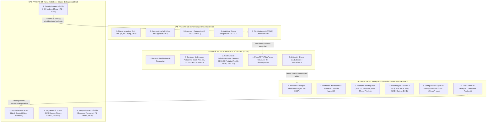

# Col·lecció de Casos Pràctics d'Oposicions TIC per a l'Administració Local

Benvingut/da a la col·lecció de **Casos Pràctics d'Oposicions TIC** adaptats específicament per a convocatòries de l'Administració Local (Ajuntaments, Diputacions, Consells Comarcals) per a les escales de **Tècnic/a Mitjà/Superior de Sistemes i Tecnologies de la Informació, CISO, Tècnic d'Administració Especial (Enginyeria Informàtica) i Tècnic d'Administració General (Àrea de Contractació i Administració Electrònica)**.

Aquests supòsits pràctics integren de forma exhaustiva la **Llei 9/2017 de Contractes del Sector Públic (LCSP)**, l'**Esquema Nacional de Seguretat (RD 311/2022)**, el **Reglament General de Protecció de Dades (RGPD / LOPDGDD)** i les **Guies de Seguretat CCN-STIC**.

---

## 🗺️ Mapa Integrat dels Casos Pràctics

Els tres supòsits pràctics conformen un **cicle complet i interconnectat** de governança de la seguretat, contractació pública i gestió operativa dels actius tecnològics municipals:

---

## 📚 Índex de Casos Pràctics

| Núm. | Títol del Cas Pràctic | Fitxer de Resolució Detallada | Normativa i Conceptes Clau |
| :---: | :--- | :--- | :--- |
| **01** | **Pla Seqüencial Integral per a l'Aprovació, Implantació i Conformitat de l'ENS a l'Organització** | [01_implantacio_i_aprovacio_ens_organitzacio.md](file:///home/oriol/Projectes/OPOS/recursos/casos_practics/01_implantacio_i_aprovacio_ens_organitzacio.md) | RD 311/2022, Arts. 11-15, 34-35; Guies CCN-STIC 800, 805, 809; Rols RI, RS, RSeg, RSis; DAICT; PILAR; INES; Certificació ENAC. |
| **02** | **Contractació Pública d'un Servei Cloud (SaaS) i Subministrament de Servidor i Llocs de Treball** | [02_contractacio_publica_saas_i_subministrament_tic.md](file:///home/oriol/Projectes/OPOS/recursos/casos_practics/02_contractacio_publica_saas_i_subministrament_tic.md) | Llei 9/2017 (LCSP Arts. 16, 17, 28, 202); RD 311/2022 Arts. 2.2, 9, 31, 32; RGPD Art. 28; CPSTIC; DMR (*Defective Media Retention*); TPM 2.0; PPT i PCAP. |
| **03** | **Procediment i Criteris de Recepció, Conformitat i Posada en Explotació de Servidor, Ordinadors i Servei SaaS** | [03_recepcio_conformitat_posada_produccio_actius_tic.md](file:///home/oriol/Projectes/OPOS/recursos/casos_practics/03_recepcio_conformitat_posada_produccio_actius_tic.md) | Art. 210 LCSP (Recepció i Liquidació); Mesures ENS `[op.ext.2]`, `[mp.eq.1-3]`, `[mp.if]`, `[op.acc]`, `[op.mon]`, `[op.cont]`; Bastionat CCN-STIC; BitLocker; iDRAC OOB; UAT. |
| **04** | **Projecte d'Arquitectura de Xarxa Segura Multi-Seu i Estratègia de Còpies de Seguretat ENS** | [04_arquitectura_xarxa_segura_i_copies_seguretat_ens.md](file:///home/oriol/Projectes/OPOS/recursos/casos_practics/04_arquitectura_xarxa_segura_i_copies_seguretat_ens.md) | Mesures ENS `[mp.com]`, `[op.cont]`, `[op.acc]`, `[mp.si]`; WAN híbrida redundant (Fibra + Antena Sectorial PTMP + 5G); OSPF amb BFD (< 300ms); DMZ Ubuntu Docker; SMBv3 xifrat; Veeam 3-2-1-1-0 immutable; M365 Business Premium + F3; Intune. |
| **05** | **Implantació d'Intel·ligència Artificial Segura (AI Act / ENS) i Robotització de Processos (RPA / AAA)** | [05_ia_segura_i_robotitzacio_processos_rpa.md](file:///home/oriol/Projectes/OPOS/recursos/casos_practics/05_ia_segura_i_robotitzacio_processos_rpa.md) | Reglament UE 2024/1689 (AI Act Art. 50); Llei 40/2015 Art. 41 (Actuació Administrativa Automatitzada); RD 311/2022 (ENS); RGPD Art. 22; RAG tancat anti-al·lucinacions; Seguretat de bots RPA (PAM, PICA/PID). |

---

## 🎯 Guia Metodològica per a la Resolució de Supòsits Pràctics d'Oposicions

Davant d'un tribunal d'oposicions, la resolució d'un supòsit pràctic no ha de ser un text desordenat d'opinions tècniques, sinó un **dictamen estructurat, precís i jurídicament fonamentat**:

### 1. Marc Normatiu d'Aplicació (Citar sempre al principi)
- Citar sempre el text legal complet: *Reial Decret 311/2022, de 3 de maig, pel qual es regula l'Esquema Nacional de Seguretat (ENS)*; *Llei 9/2017, de 8 de novembre, de Contractes del Sector Públic (LCSP)*; *Llei 40/2015, de règim jurídic del sector públic*; *Reglament (UE) 2016/679 (RGPD)*.

### 2. Estructura de Governança i Rols
- Identificar clarament qui té la competència administrativa (Alcaldia, Ple, Junta de Govern Local) i qui executa cada funció tècnica segons el **Principi de Diferenciació de Responsabilitats** (Responsable de la Informació, Responsable del Servei, Responsable de Seguretat - CISO, Responsable del Sistema - Administrador TIC).

### 3. Fases Seqüencials d'Actuació
- Presentar la resposta organitzada en fases cronològiques clares (Fase 1: Preparació/Governança, Fase 2: Execució tècnica, Fase 3: Proves i conformitat, Fase 4: Manteniment i millora contínua).
- Utilitzar diagrames de flux conceptuals i taules comparatives.

### 4. Precisió Tècnica i Mesures Específiques
- Anomenar les mesures concretes de l'Annex II de l'ENS pel seu codi identificador (`[mp.eq.1]`, `[op.acc.5]`, `[mp.si.1]`, etc.).
- Utilitzar terminologia tècnica estàndard: *TPM 2.0, BitLocker AES-256, Secure Boot, VLAN de gestió OOB, LACP, RAID 1/10, EDR, SIEM, SAML 2.0 / OIDC, MFA, clàusula DMR*.

### 5. Tancament Administratiu i Documental
- Finalitzar sempre el cas pràctic amb el tràmit administratiu preceptiu: *Decret d'Alcaldia d'aprovació*, *Acord de Junta de Govern*, *Acta formal de recepció segons l'article 210 de la LCSP*, o *Certificat / Declaració de Conformitat amb l'ENS*.

---

## 🔗 Relació amb els Temes Teòrics del Repositori

Aquests casos pràctics posen en aplicació els coneixements desenvolupats als següents temes:
- **Part General:**
  - [Tema 14: Tipus de contractes del sector públic (LCSP)](file:///home/oriol/Projectes/OPOS/part_general/14_tipus_contractes_sector_public_lcsp.md)
  - [Tema 15: Preparació de contractes, expedient i plecs (PCAP i PPT)](file:///home/oriol/Projectes/OPOS/part_general/15_preparacio_contractes_expedient_plecs.md)
- **Part Específica:**
  - [Tema 32: Organització d'un departament TIC: infraestructura i estratègia](file:///home/oriol/Projectes/OPOS/part_especifica/bloc3_infraestructura_i_seguretat/32_organitzacio_departament_tic_estrategia.md)
  - [Tema 33: Equipament del lloc de treball, inventari i programari](file:///home/oriol/Projectes/OPOS/part_especifica/bloc3_infraestructura_i_seguretat/33_equipament_lloc_treball_inventari_distribucio_programari.md)
  - [Tema 36: Centres de Procés de Dades (CPD): característiques físiques](file:///home/oriol/Projectes/OPOS/part_especifica/bloc3_infraestructura_i_seguretat/36_centres_processament_dades_cpd_caracteristiques_fisiques.md)
  - [Tema 37: Definició d'una política de seguretat de la informació](file:///home/oriol/Projectes/OPOS/part_especifica/bloc3_infraestructura_i_seguretat/37_definicio_politica_seguretat.md)
  - [Tema 62: Serveis al núvol: IaaS, PaaS, SaaS i requisits ENS](file:///home/oriol/Projectes/OPOS/part_especifica/bloc4_aplicacions_i_serveis/62_serveis_nuvol_iaas_paas_saas_privat_public_hibrid.md)
  - [Tema 87: Protecció de dades: RGPD, LOPDGDD i APDCAT](file:///home/oriol/Projectes/OPOS/part_especifica/bloc7_normatives_especifiques/87_proteccio_dades_rgpd_lopdgdd_apdcat.md)
  - [Tema 89: Esquema Nacional de Seguretat (ENS - RD 311/2022)](file:///home/oriol/Projectes/OPOS/part_especifica/bloc7_normatives_especifiques/89_esquema_nacional_seguretat_ens_mesures_auditoria_incidents.md)
- **Procediments Operatius:**
  - [Procediments Operatius de Seguretat (POS)](file:///home/oriol/Projectes/OPOS/recursos/procediments_ens/README.md)
