# Procediment Operatiu de Seguretat (POS): Arribada i Posada en Producció d'un Servidor Nou

> **Marc Normatiu de Referència:** Reial Decret 311/2022 (ENS) — Mesures `[mp.eq.1]` (Inventari), `[mp.eq.2]` (Bastionat d'equips), `[mp.if.1-4]` (Instal·lacions del CPD), `[op.pl.1]` (Planificació de la seguretat), `[op.pl.4]` (Gestió de la configuració), `[op.mon]` (Monitorització i logs) i Guies CCN-STIC (sèries 800 i guies de bastionat de SO).  
> **Àmbit d'Aplicació:** Servidors físics d'infraestructura local (CPD de l'Ajuntament) i servidors virtuals / instàncies IaaS.

---

## 1. Objectiu i Abast

Aquest procediment estableix el circuit formal, tècnic i de seguretat que cal seguir des que es rep o es sol·licita l'aprovisionament d'un nou servidor (físic o virtual) fins a la seva posada en explotació definitiva, garantint que cap equip s'incorpori a la xarxa corporativa sense haver superat els controls de bastionat (*hardening*), monitorització, gestió d'accessos i registre d'inventari preceptius per l'**Esquema Nacional de Seguretat (RD 311/2022)**.

---

## 2. Rols Intervinents segons l'ENS

| Rol ENS | Responsable / Departament | Funcions en aquest Procediment |
| :--- | :--- | :--- |
| **Responsable de la Informació (RI)** | Cap de l'Àrea Usuària / Gestora de dades | Determina els requisits de confidencialitat i integritat de les dades que allotjarà el servidor. |
| **Responsable del Servei (RS)** | Cap del Servei o Unitat Funcional | Fixa els requisits de disponibilitat, RPO i RTO del servei suportat pel servidor. |
| **Responsable de la Seguretat (RSeg / CISO)** | Cap de Seguretat de la Informació | Valida el dimensionament de seguretat, aprova la configuració de bastionat, verifica el compliment ENS i autoritza la connexió a la xarxa. |
| **Responsable del Sistema (RSis)** | Cap d'Informàtica / Administrador de Sistemes | Executa la instal·lació física al rack/CPD o aprovisionament a l'hipervisor, configura el SO, aplica pedaços, configura còpies de seguretat i registra l'actiu a la CMDB. |
| **Proveïdor / Integrador de Maquinari** | Empresa externa adjudicatària | Lliura l'equip segons les especificacions del plec tècnic i amb firmware actualitzat. |

---

## 3. Diagrama de Flux del Procediment

```mermaid
flowchart TD
    Start(["📦 1. Recepció del Servidor (Físic o VM)"]) --> RegInventari["📋 2. Verificació i Registre d'Actiu (CMDB / GLPI)<br/>• S/N, model, garanties, etiquetatge físic<br/>• Assignació d'identificador d'actiu"]
    
    RegInventari --> InstalFisica{"És Servidor Físic o VM?"}
    
    InstalFisica -- "Físic (CPD)" --> CPD["🏢 3A. Muntatge a CPD [mp.if]<br/>• Fixació a Rack i cablejat estructurat<br/>• Doble font d'alimentació (línies A+B / SAI)<br/>• Connexió a Switch de gestió out-of-band (iLO/iDRAC) en VLAN aïllada"]
    InstalFisica -- "Virtual (IaaS/Hypervisor)" --> VM["☁️ 3B. Aprovisionament a Clúster<br/>• Assignació de vCPU, vRAM, vDisk sobre SAN RAID<br/>• Aïllament de xarxa per vSwitch / VLAN"]
    
    CPD --> Hardening["🔒 4. Bastionat i Seguretat Base (Hardening) [mp.eq.2]<br/>• Actualització Firmware / BIOS / UEFI amb Secure Boot<br/>• Canvi preceptiu de credencials per defecte d'administració<br/>• Instal·lació de SO net i mínim (Sense paquets innecessaris)<br/>• Desactivació de ports/serveis prescindibles (Telnet, SMBv1, etc.)<br/>• Configuració de xifratge de volum (LUKS / BitLocker)<br/>• Parchejat complet d'actualitzacions del SO"]
    VM --> Hardening
    
    Hardening --> XarxaSegura["🌐 5. Segmentació de Xarxa i Firewall [mp.if.3 / mp.com]<br/>• Assignació d'IP estàtica en la VLAN corresponent (DMZ, Apps o BD)<br/>• Prohibició d'exposició directa a Internet sense Reverse Proxy / WAF<br/>• Regles de Firewall perimetral i local (UFW / Windows Firewall)"]
    
    XarxaSegura --> ControlsSeguretat["🛡️ 6. Desplegament d'Agents de Seguretat [mp.si]<br/>• Agent d'Antivirus / EDR corporatiu connectat al SOC<br/>• Agens de gestió remota i auditories (SCCM / Ansible / Wazuh)<br/>• Configuració de tramesa de logs de seguretat (Syslog / SIEM)"]
    
    ControlsSeguretat --> BackupContingencia["💾 7. Integració a Còpies de Seguretat [op.cont]<br/>• Inclusió a la política de backup (Regla 3-2-1 immutable)<br/>• Prova pilot de restauració (RTO/RPO definit pel RS)"]
    
    BackupContingencia --> EscaneigVuln["🔍 8. Escaneig de Vulnerabilitats Previ a Producció<br/>• Escaneig de ports i vulnerabilitats (OpenVAS / Nessus)<br/>• Validació de la llista de comprovació ENS de la Guia CCN-STIC"]
    
    EscaneigVuln --> DecisioVuln{"S'han detectat<br/>vulnerabilitats crítiques o altes?"}
    
    DecisioVuln -- "SÍ" --> Correccio["🛠️ Resolució de deficiències i tornada a escanejar"]
    Correccio --> EscaneigVuln
    
    DecisioVuln -- "NO" --> VistoBueno["✍️ 9. Validació i Autorització de Posada en Producció<br/>• Aprovació formal del Responsable de Seguretat (RSeg)<br/>• Registre de la línia base de configuració a la CMDB"]
    
    VistoBueno --> Produccio(["🚀 10. SERVIDOR EN PRODUCCIÓ I MONITORITZAT (24/7)"])
```

---

## 4. Fases Detallades d'Execució

### Fase 1: Recepció i Registre a l'Inventari d'Actius (`[mp.eq.1]`)
1. **Inspecció visual:** El Responsable del Sistema comprova que l'embalatge no presenta signes de manipulació indeguda i que els precintes de seguretat del fabricant estan intactes.
2. **Alta a l'inventari (CMDB / GLPI):**
   - Número de sèrie (S/N), model, fabricant, data d'adquisició, contracte associat i garantia.
   - Assignació d'etiqueta d'inventari municipal visible amb codi de barres/QR.
   - Identificació del Responsable del Servei (propietari funcional) i Responsable del Sistema (administrador tècnic).
   - Classificació de seguretat preliminar segons la informació que albergarà (Bàsica, Mitjana o Alta segons l'Art. 15 del RD 311/2022).

### Fase 2: Instal·lació Física al CPD o Aprovisionament Virtual (`[mp.if.1]`, `[mp.eq.1]`)
- **Per a servidors físics:**
  - Ubicació física al rack assignat al CPD municipal (zona d'accés restringit amb registre biomètric o targeta de proximitat `[mp.if.2]`).
  - Connexió a dues branques elèctriques independents connectades a SAIs redundants (`A` i `B`).
  - Cablatge de dades estructurat i etiquetatge de les interfícies de xarxa (ports d'accés i trunks).
  - Connexió de la interfície de gestió física (*iLO / iDRAC / IPMI*) a una **VLAN aïllada de gestió OOB (*Out-Of-Band*)**, mai compartida amb xarxa d'usuaris ni accessible des d'Internet.
- **Per a servidors virtuals:**
  - Desplegament de la plantilla corporativa oficial homologada sobre el clúster d'alta disponibilitat.
  - Aïllament de recursos i assignació de vSwitch a la xarxa aïllada de preproducció.

### Fase 3: Bastionat (*Hardening*) segons Guies CCN-STIC (`[mp.eq.2]`)
1. **Firmware i arrencada:**
   - Actualització del firmware de la placa base i targetes a l'última versió estable.
   - Activació de **UEFI Secure Boot** i contrasenya d'administrador de BIOS/UEFI.
   - Inhabilitació de l'arrencada des de dispositius externs (USB, CD/DVD, PXE no corporatiu).
2. **Credencials i accessos:**
   - Canvi obligatori de totes les claus i contrasenyes d'administració per defecte de fàbrica per claus robustes d'alta complexitat (mínim 16 caràcters, custodiades al gestor de contrasenyes corporatiu).
   - Desactivació del compte predeterminat `guest` o `invitado`.
   - Restricció de l'accés per SSH o RDP exclusivament a adreces IP de la xarxa de gestió autoritzada, amb autenticació mitjançant clau criptogràfica o MFA.
3. **Minimització de serveis i protocols:**
   - Instal·lació del sistema operatiu en mode mínim (*Core* en Windows Server o *Minimal Server* en Linux).
   - Inhabilitació de protocols insegurs o obsolets: Telnet, FTP sense xifrar, SMBv1, SSLv2, SSLv3, TLS 1.0, TLS 1.1.
   - Desactivació de ports TCP/UDP innecessaris.
4. **Xifratge de discs (`[mp.eq.3]`):**
   - Habilitació de BitLocker (amb custòdia de la clau de recuperació a l'Active Directory / Entra ID) o LUKS en entorns Linux.

### Fase 4: Protecció, Logs i Còpies de Seguretat (`[mp.si]`, `[op.mon]`, `[op.cont]`)
1. **Agent EDR / Antivirus corporatiu:** Instal·lació de l'agent de seguretat endpoint monitoritzat en temps real pel Centre d'Operacions de Seguretat (SOC).
2. **Traçabilitat i Logs (`[op.mon]`):**
   - Sincronització de l'hora del sistema mitjançant el protocol NTP amb el servidor d'hora corporatiu oficial (hora oficial de l'Estat segons ROA / NTI).
   - Configuració de tramesa de logs d'auditoria (inici de sessió, canvis de privilegis, accessos fallits) cap al SIEM municipal centralitzat.
3. **Còpies de seguretat:**
   - Integració immediata en el programari de còpies de seguretat corporatiu.
   - Definició de tasques de còpia incremental diària i completa setmanal amb retenció immutable (protecció contra atacs de *ransomware*).

### Fase 5: Avaluació de Vulnerabilitats i Autorització Formal (`[op.pl.5]`, `[org.2]`)
1. **Escaneig de seguretat:** L'equip de seguretat executa una anàlisi de vulnerabilitats automatitzada (Nessus / OpenVAS) sobre el nou servidor.
2. **Llista de verificació:** Es completa la checklist de conformitat amb l'ENS segons la categoria del sistema.
3. **Signatura de posada en producció:** El Responsable de Seguretat (RSeg) emet el vistiplau per escrit o mitjançant tràmit a l'eina de gestió de canvis (CAB).
4. **Pas a producció:** S'apliquen les regles de firewall definitives per permetre el trànsit d'usuaris o serveis des de la VLAN autoritzada.

---

## 5. Llista de Verificació (Checklist) Previa a la Producció

- [ ] L'equip té número d'inventari i està registrat a la CMDB.
- [ ] La contrasenya per defecte d'administració (iLO/iDRAC i SO) s'ha canviat per una contrasenya forta emmagatzemada de forma segura.
- [ ] La consola de gestió remota OOB està connectada exclusivament a la VLAN de gestió aïllada.
- [ ] El disc de dades i de sistema està xifrat (BitLocker / LUKS).
- [ ] El Secure Boot de la BIOS/UEFI està habilitat.
- [ ] S'han aplicat totes les actualitzacions de seguretat pendents del sistema operatiu.
- [ ] S'ha instal·lat l'agent EDR i s'ha comprovat que reporta correctament a la consola del SOC.
- [ ] Els logs de seguretat s'envien correctament al servidor de logs / SIEM.
- [ ] L'equip està integrat a les tasques de còpia de seguretat diària i s'ha verificat la seva restauració.
- [ ] S'ha realitzat l'escaneig de vulnerabilitats i no hi ha alertes crítiques ni altes pendents de resolució.
- [ ] El Responsable de Seguretat ha signat l'acta d'autorització de pas a producció.
