# Procediment Operatiu de Seguretat (POS): Contractació i Desplegament d'un Servei Cloud / SaaS Nou

> **Marc Normatiu de Referència:** Reial Decret 311/2022 (ENS) — Arts. 2.2, 9 i Mesures `[op.ext.1]` (Contractació de serveis externs), `[op.ext.2]` (Conformitat amb l'ENS del proveïdor), `[org.3]` (Formació i deures del personal proveïdor), Guies CCN-STIC 823 (Sistemes en el Núvol), Guia CCN-STIC 844 (Clàusules de Seguretat en la Contractació), Catàleg CPSTIC i Art. 28 del RGPD (Encarregat del Tractament).  
> **Àmbit d'Aplicació:** Qualsevol plataforma de programari com a servei (SaaS), núvol privat, públic o híbrid contractada per l'Ajuntament.

---

## 1. Objectiu i Abast

Aquest procediment defineix les etapes administratives, jurídiques i tècniques obligatòries per a l'adquisició, integració i governança de serveis de programari al núvol (**SaaS - Software as a Service**). 

L'objectiu fonamental és assegurar que cap proveïdor de núvol pugui allotjar o tractar informació municipal sense acreditar prèviament la seva **Conformitat formal amb l'Esquema Nacional de Seguretat (RD 311/2022)** i garantir que la gestió d'accessos, identitats i dades compleixi amb les màximes exigències de ciberseguretat.

> ⚠️ **Principi Jurídic Clau de l'ENS:** La contractació d'un servei extern o la delegació tècnica en un proveïdor de núvol **mai eximeix l'Ajuntament de la responsabilitat final** sobre la protecció i confidencialitat de les dades de la ciutadania (l'Ajuntament continua sent el Responsable del Tractament).

---

## 2. Rols Intervinents segons l'ENS

| Rol ENS | Responsable / Òrgan | Responsabilitats Específiques en SaaS |
| :--- | :--- | :--- |
| **Responsable de la Informació (RI)** | Cap d'Àrea Funcional de les dades | Determina el tipus i sensibilitat de la informació tractada al SaaS i assigna la categoria ENS (Bàsica, Mitjana o Alta segons l'impacte DAICT). |
| **Responsable del Servei (RS)** | Cap d'Unitat Operativa usuària | Valida que les prestacions del SaaS cobreixen les necessitats de negoci i estableix els Acords de Nivell de Servei (SLA) exigibles. |
| **Responsable de la Seguretat (RSeg / CISO)** | Cap de Seguretat de la Informació | Redacta les clàusules de seguretat ENS per als plecs, verifica els certificats ENS del proveïdor al Catàleg CPSTIC/ENAC, avalua els riscos i autoritza la integració. |
| **Delegat de Protecció de Dades (DPD)** | DPD Municipal | Revisa i valida l'Acord d'Encarregat del Tractament (DPA - Art. 28 RGPD) i verifica la ubicació dels servidors (Espai Econòmic Europeu - EEE). |
| **Responsable del Sistema (RSis)** | Cap d'Informàtica / Administrador TIC | Configura la federació d'identitats (SSO), les polítiques d'accés condicional i MFA, el pla d'extracció de còpies i la connexió de logs al SIEM. |
| **Unitat de Contractació / Secretaria** | Departament de Compres i Contractació | Assegura la inclusió preceptiva de les clàusules de seguretat ENS i penalitzacions contractuals en el PCAP i PPT. |

---

## 3. Diagrama de Flux del Procediment

```mermaid
flowchart TD
    Inici(["📝 1. Detecció de la Necessitat d'un nou SaaS"]) --> CatENS["🎯 2. Categorització de la Informació (DAICT)<br/>• El Responsable d'Informació valora l'impacte<br/>• Es determina el nivell ENS requerit (Bàsica, Mitjana o Alta)"]
    
    CatENS --> Plecs["📑 3. Redacció de Plecs (PCAP i PPT) amb Requisits ENS [op.ext.1]<br/>• Exigència de Certificat de Conformitat ENS (Art. 41)<br/>• Ubicació de dades a la UE / Espai Econòmic Europeu<br/>• Acord de Nivell de Servei (SLA) i suport 24/7<br/>• Clàusules de reversibilitat, portabilitat i destrucció de dades"]
    
    Plecs --> Licitacio["⚖️ 4. Licitació i Valoració d'Ofertes<br/>• Verificació de la Certificació ENS de cada licitador al registre ENAC/CCN<br/>• Comprovació al Catàleg CPSTIC (serveis qualificats)"]
    
    Licitacio --> DecisioCert{"El proveïdor té Certificat ENS vigent d'igual o superior nivell?"}
    
    DecisioCert -- "NO" --> Exclusio["❌ Exclusió de l'oferta per incompliment dels plecs tècnics"]
    
    DecisioCert -- "SÍ" --> Adjudicacio["✍️ 5. Formalització Contractual i Annexos de Seguretat<br/>• Signatura de l'Acord d'Encarregat del Tractament (DPA - Art. 28 RGPD)<br/>• Compromís de compliment de la PSI municipal per part del proveïdor<br/>• Aprovació prèvia del DPD"]
    
    Adjudicacio --> AvalRisc["📊 6. Anàlisi de Riscos i AIPD (si escau)<br/>• Anàlisi de riscos de la integració (PILAR / MAGERIT)<br/>• Avaluació d'Impacte en la Protecció de Dades si hi ha dades sensibles"]
    
    AvalRisc --> DesplegamentTecnic["🔧 7. Configuració Tècnica i Integració Segura [op.acc / op.mon]<br/>• Federació d'identitats (SSO) amb Entra ID / SAML 2.0 / OIDC<br/>• Imposició obligatòria d'Autenticació Multifactor (MFA)<br/>• Accés condicional: Només dispositius gestionats i geoblocking<br/>• Assignació d'accessos segons el principi de menor privilegi<br/>• Integració de logs d'auditoria amb el SIEM municipal"]
    
    DesplegamentTecnic --> ResguardDades["💾 8. Estratègia de Còpia de Seguretat i Sortida (Exit Strategy)<br/>• Prova d'exportació autònoma de dades en format estàndard interoperable<br/>• Programació de backups periòdics municipals fora del SaaS"]
    
    ResguardDades --> ValidacioFinal["🛡️ 9. Validació de Seguretat pel CISO / RSeg<br/>• Checklist de conformitat Guia CCN-STIC 823 superada<br/>• Autorització formal d'entrada en explotació"]
    
    ValidacioFinal --> Produccio(["🚀 10. SAAS EN PRODUCCIÓ AMB MONITORITZACIÓ I AUDITORIA ANUAL"])
```

---

## 4. Fases Detallades d'Execució

### Fase 1: Categorització de la Informació i Definició d'Impacte (`[op.ext.1]`, Art. 15)
Abans d'iniciar la contractació, el **Responsable de la Informació (RI)** i el **Responsable del Servei (RS)** analitzen el servei:
1. Valoren l'impacte potencial de pèrdua en les 5 dimensions: Disponibilitat, Autenticitat, Integritat, Confidencialitat i Traçabilitat (**DAICT**).
2. Es determina la categoria del sistema:
   - **Bàsica:** Impacte màxim BAIX en totes les dimensions.
   - **Mitjana:** Impacte MITJÀ en almenys una dimensió (p. ex., gestió d'expedients administratius ordinaris).
   - **Alta:** Impacte ALT en almenys una dimensió (p. ex., dades tributàries, serveis socials, sistemes de policia local).
3. **Regla d'or:** El proveïdor del SaaS ha d'estar certificat en una categoria **igual o superior** a la de la informació que allotjarà.

### Fase 2: Redacció de Plecs de Contractació (Guia CCN-STIC 844)
La Unitat de Contractació incorpora obligatòriament al Plec de Prescripcions Tècniques (PPT) les clàusules de seguretat definides pel Responsable de Seguretat (RSeg):
1. **Certificació ENS:** Exigència de presentar el *Certificat de Conformitat amb l'ENS* emès per una entitat acreditada per ENAC (per a categories Mitjana i Alta).
2. **Residència de les dades:** Prohibició explícita de transferències internacionals de dades fora de l'Espai Econòmic Europeu (EEE) sense autorització expressa i garanties conformes al Capítol V del RGPD.
3. **Notificació d'incidents:** Deure del proveïdor de notificar a l'Ajuntament qualsevol incident de seguretat en un termini màxim de **24 hores** (per permetre complir el termini de 72h davant l'APDCAT i CCN-CERT).
4. **Acord de Nivell de Servei (SLA):** Disponibilitat mínima garantida (p. ex., 99,7%), finestres de manteniment pactades fora de l'horari d'atenció ciutadana, i penalitzacions per indisponibilitat.
5. **Reversibilitat i portabilitat (Exit Strategy):** Obligació de retornar totes les dades municipals en formats oberts i estandarditzats (XML, JSON, SQL, PDF/A) en cas d'extinció contractual, i procedir a la destrucció segura certificada de les còpies emmagatzemades pel proveïdor segons la Guia CCN-STIC 830.

### Fase 3: Adjudicació, Acord DPA i Avaluació de Riscos
1. **Comprovació d'acreditacions:** El RSeg comprova la validesa i abast del certificat ENS del proveïdor al portal del CCN-CERT i a la llista d'empreses certificades per ENAC.
2. **Contracte d'Encarregat del Tractament (Art. 28 RGPD):** Es formalitza amb l'assessorament preceptiu del DPD municipal.
3. **Anàlisi de riscos:** S'actualitza el mapa de riscos de l'Ajuntament incorporant el nou proveïdor i la dependència tecnològica.

### Fase 4: Configuració Tècnica i Integració d'Identitats (`[op.acc]`, `[op.mon]`)
El Responsable del Sistema aplica les mesures tècniques per evitar que el SaaS esdevingui un *silot* aïllat o vulnerable:
1. **Single Sign-On (SSO):** El SaaS s'ha de federar obligatòriament amb el proveïdor d'identitats corporatiu municipal (Microsoft Entra ID / Active Directory) mitjançant SAML 2.0 o OpenID Connect.
2. **Prohibició de credencials locals:** Cap usuari municipal utilitzarà contrasenyes locals independents creades directament al portal del proveïdor SaaS.
3. **MFA Obligatori (`[op.acc.1]`):** L'accés al SaaS exigeix imperativament autenticació de doble factor (2FA/MFA) gestionada pel tenant corporatiu.
4. **Polítiques d'accés condicional:**
   - Restricció d'accés exclusivament a dispositius corporatius gestionats (compliment d'antivirus i xifratge).
   - Bloqueig de connexions procedents de països no autoritzats (*geoblocking*).
5. **Logs i SIEM (`[op.mon]`):** S'activa la descàrrega o enviament automàtic dels registres d'auditoria (logs d'accés i activitat del SaaS) mitjançant API cap al SIEM corporatiu municipal.

### Fase 5: Estratègia de Còpia de Seguretat Independent i Sortida
1. No dependre exclusivament del backup intern del SaaS: es programa una tasca d'extracció periòdica (API / exportació automatitzada) de les dades cap a l'emmagatzematge municipal segur.
2. Es realitza una prova pràctica d'importació i lectura de les dades descarregades per verificar que no hi ha segrest tecnològic (*vendor lock-in*).

---

## 5. Llista de Verificació (Checklist) d'Alta de SaaS

- [ ] S'ha determinat formalment la categoria ENS de la informació allotjada (Bàsica, Mitjana o Alta).
- [ ] El plec tècnic ha exigit la certificació ENS i la ubicació dels servidors a la UE.
- [ ] S'ha verificat la vigència del Certificat de Conformitat ENS del proveïdor a la base de dades d'ENAC.
- [ ] S'ha signat l'Acord d'Encarregat del Tractament (Art. 28 RGPD) validat pel DPD.
- [ ] S'ha realitzat l'Anàlisi de Riscos de la solució núvol.
- [ ] L'autenticació està integrada mitjançant SSO corporatiu (SAML 2.0 / OIDC).
- [ ] L'accés requereix imperativament Autenticació Multifactor (MFA).
- [ ] S'han aplicat polítiques d'accés condicional per bloquejar connexions insegures.
- [ ] S'ha establert un mecanisme d'extracció de logs cap al SIEM municipal.
- [ ] S'ha definit i provat el procediment d'extracció de dades per a còpies de seguretat autònomes.
- [ ] El Responsable de Seguretat ha emès l'informe favorable de posada en producció.
