# Procediment Operatiu de Seguretat (POS): Arribada i Aprovisionament d'un Equip de Lloc de Treball Nou

> **Marc Normatiu de Referència:** Reial Decret 311/2022 (ENS) — Mesures `[mp.eq.1]` (Inventari d'equips), `[mp.eq.2]` (Bastionat d'equips de treball), `[mp.eq.3]` (Xifratge de dispositius mòbils i portàtils), `[op.acc.1]` (Identificació i autenticació), `[op.acc.4]` (Assignació de privilegis mínims), `[mp.si.1]` (Protecció contra codi maliciós / EDR), `[org.1]` (Compromís i acceptació de la Política de Seguretat) i Guia CCN-STIC 808 / 818.  
> **Àmbit d'Aplicació:** Ordinadors de sobretaula, portàtils, estacions de treball i tauletes corporatives destinades als treballadors de l'Ajuntament.

---

## 1. Objectiu i Abast

Aquest procediment estableix el protocol homogeni que s'ha d'aplicar des de la recepció física d'un equip informàtic de lloc de treball (ordinador de sobretaula o portàtil) fins al seu lliurament efectiu a l'empleat públic.

Cap dispositiu podrà connectar-se a la xarxa corporativa de l'Ajuntament ni accedir a les aplicacions municipals sense haver estat prèviament inventariat, bastionat segons els estàndards de l'**Esquema Nacional de Seguretat (RD 311/2022)**, amb el disc xifrat, sota gestió centralitzada de directori i amb l'agent de seguretat EDR operatiu.

---

## 2. Rols Intervinents segons l'ENS

| Rol ENS | Responsable / Departament | Funcions Específiques |
| :--- | :--- | :--- |
| **Responsable de la Informació (RI)** | Cap d'Àrea de l'usuari | Valida que l'empleat té necessitat d'accedir a les dades municipals segons el seu perfil de lloc. |
| **Responsable de la Seguretat (RSeg / CISO)** | Cap de Seguretat de la Informació | Defineix la línia base de configuració segura (*Golden Master* / perfil Intune), la política de contrasenyes, el protocol de teletreball i el model de compromís d'ús acceptable. |
| **Responsable del Sistema (RSis)** | Equip de Suport TIC / Informàtica | Registra l'actiu a l'inventari, aplica la imatge corporativa, verifica el xifratge BitLocker, elimina privilegis administratius locals i realitza el lliurament físic. |
| **Empleat Públic (Usuari)** | Treballador municipal receptor | Rep l'equip, signa l'acta de recepció i el document d'acceptació de la Política de Seguretat de la Informació (PSI) i en fa un ús estricte professional. |

---

## 3. Diagrama de Flux del Procediment

```mermaid
flowchart TD
    Recepcio(["📦 1. Arribada del Nou Equip (Sobretaula / Portàtil)"]) --> Inventari["📋 2. Registre i Etiquetatge d'Inventari [mp.eq.1]<br/>• Verificació física de components i albarà de compra<br/>• Lectura de número de sèrie (S/N) i adreça MAC<br/>• Adhesió d'etiqueta d'inventari municipal amb codi QR<br/>• Alta a la CMDB / GLPI amb estat 'En preparació'"]
    
    Inventari --> BiosHardening["⚙️ 3. Configuració Segura de BIOS / UEFI [mp.eq.2]<br/>• Activació obligatòria de xip TPM 2.0 i Secure Boot<br/>• Fixació de contrasenya d'administrador de BIOS/UEFI<br/>• Bloqueig de l'arrencada des de memòries USB externes"]
    
    BiosHardening --> ImatgeSO["💻 4. Instal·lació de la Imatge Corporativa [mp.eq.2]<br/>• Desplegament automatitzat (Windows Autopilot / Intune / WDS)<br/>• Unió al domini corporatiu (Active Directory / Entra ID)<br/>• Desinstal·lació de programari preinstal·lat (Bloatware)"]
    
    ImatgeSO --> XifratgeDisc["🔐 5. Xifratge Integral del Disc [mp.eq.3]<br/>• Activació de xifratge BitLocker (AES-256) lligat al xip TPM<br/>• Còpia automàtica de la clau de recuperació a l'Active Directory / Entra ID<br/>• Prova de bloqueig si s'intenta manipular el xip de disc"]
    
    XifratgeDisc --> PolitiquesGPO["🛡️ 6. Aplicació de Polítiques de Seguretat (GPO / Intune)<br/>• Privilegis mínims: L'usuari és USUARI ESTÀNDARD (mai administrador) [op.acc.4]<br/>• Bloqueig d'emmagatzematge massiu USB no autoritzat [mp.si.5]<br/>• Bloqueig automàtic de pantalla per inactivitat (màx. 10 minuts)<br/>• Política de contrasenyes robustes (mínim 12 caràcters)"]
    
    PolitiquesGPO --> EinesSeguretat["🦠 7. Desplegament d'Eines de Seguretat [mp.si.1 / op.mon]<br/>• Agent d'Antivirus / EDR corporatiu actiu i reportant al SOC<br/>• Client VPN corporatiu amb autenticació MFA (per a portàtils)<br/>• Certificat digital de dispositiu per a accés a xarxa 802.1X"]
    
    EinesSeguretat --> Actualitzacions["🔄 8. Actualitzacions del Sistema Operatiu i Aplicacions<br/>• Instal·lació de tots els pedaços acumulatius de seguretat (Windows Update / WSUS)<br/>• Validació de l'estat de compliment (Compliance check)"]
    
    Actualitzacions --> SignaturaActa["✍️ 9. Lliurament Formal i Acceptació de la PSI [org.1]<br/>• Explicació de bones pràctiques i procediments de suport (Helpdesk)<br/>• Signatura de l'Acta de Lliurament d'Equipament Informàtic<br/>• Signatura del Compromís de Compliment de la Política de Seguretat i Teletreball"]
    
    SignaturaActa --> ActiuCMDB["📝 10. Canvi d'Estat a l'Inventari i Posada en Servei<br/>• Associació de l'actiu a l'usuari assignat a la CMDB<br/>• Estat de l'equip: 'En servei'"]
    
    ActiuCMDB --> Final(["🚀 EQUIP EN PRODUCCIÓ I MONITORITZAT PEL SOC"])
```

---

## 4. Fases Detallades d'Execució

### Fase 1: Recepció, Control i Inventari (`[mp.eq.1]`)
1. **Comprovació de comanda:** El tècnic de sistemes contrasta la comanda rebuda amb l'albarà de lliurament del proveïdor.
2. **Alta d'actiu a l'eina ITSM (GLPI / CMDB):**
   - Fabricant, model comercial i número de sèrie de fàbrica.
   - Adreces físiques MAC de les interfícies de xarxa (Ethernet i Wi-Fi) per a la gestió d'accés per xarxa (*NAC / 802.1X*).
   - Assignació de codi identificatiu d'inventari municipal (p. ex., `AJSTJ-PC-0145`).
   - Fixació d'etiqueta adhesiva destructible de seguretat amb codi de barres/QR visible al xassís de l'equip.

### Fase 2: Bastionat de Maquinari i BIOS/UEFI (`[mp.eq.2]`)
1. **Configuració de firmware:**
   - Activació obligatòria del mòdul **TPM 2.0 (*Trusted Platform Module*)**.
   - Activació de **Secure Boot** per garantir que només s'executen gestors d'arrencada signats criptogràficament per Microsoft/fabricant.
   - Definició d'una contrasenya d'administrador de BIOS robusta coneguda exclusivament pel departament TIC.
   - Desactivació de l'arrencada des d'unitats USB o xarxa pública no autoritzada.

### Fase 3: Desplegament de la Imatge Corporativa i Xifratge (`[mp.eq.2]`, `[mp.eq.3]`)
1. **Desplegament automatitzat:** Mitjançant solucions centralitzades (**Microsoft Intune / Autopilot** o servidor d'imatges WDS), s'instal·la la imatge neta de Windows 11 Enterprise o Linux corporatiu.
2. **Unió al domini:** L'equip s'uneix al domini corporatiu (*Active Directory* local o *Microsoft Entra ID* híbrid).
3. **Xifratge integral de disc BitLocker (`[mp.eq.3]`):**
   - S'activa el xifratge complet de la unitat del sistema (xifratge XTS-AES de 256 bits).
   - La clau de xifratge queda vinculada al xip TPM 2.0 de l'equip.
   - La clau de recuperació d'emergència s'emmagatzema automàticament a l'Active Directory o consola d'Entra ID (mai en suport físic o paper al costat de l'ordinador).

### Fase 4: Restricció de Privilegis i Mesures de Seguretat (`[op.acc.4]`, `[mp.si.5]`)
1. **Principi de privilegis mínims:**
   - Els comptes d'usuari corporatiu dels empleats pertanyen exclusivament al grup d'**Usuaris Estàndard**.
   - **Es prohibeix terminantment atorgar permisos d'administrador local** als empleats públics, prevenint la instal·lació de programari pirata o no homologat i minimitzant l'impacte d'atacs de *malware*.
2. **Control de mitjans extraïbles (`[mp.si.5]`):**
   - Bloqueig per política centralitzada (GPO/Intune) de la connexió de memòries USB no autoritzades d'emmagatzematge massiu per evitar fuites d'informació o infeccions per cucs informàtics.
3. **Bloqueig de sessió per inactivitat:**
   - Bloqueig automàtic de pantalla requerint contrasenya o reconeixement biomètric/PIN als **10 minuts d'inactivitat**.
4. **Protecció EDR i Xarxa:**
   - Desplegament de l'agent d'antivirus de nova generació (**EDR / XDR**) connectat en temps real al Centre d'Operacions de Seguretat (SOC).
   - Instal·lació del client VPN corporatiu amb autenticació multifactor (MFA) per a ús exclusiu en cas de teletreball.

### Fase 5: Lliurament Formal i Acceptació de Responsabilitats (`[org.1]`)
1. **Lliurament:** El tècnic fa entrega de l'equip a l'empleat públic a les oficines municipals.
2. **Signatura d'acta:** L'empleat signa l'**Acta de Lliurament d'Equipament Informàtic**, que inclou:
   - Identificació de l'equip, accessoris lliurats (carregador, motxilla, ratolí) i estat físic.
   - Declaració de presa de coneixement de la **Política de Seguretat de la Informació (PSI)** de l'Ajuntament.
   - Obligació de custòdia diligent, prohibició de cessió a tercers (inclosos familiars en cas de teletreball), i deure de reportar immediatament qualsevol pèrdua, robatori o incidència de seguretat.
3. **Activació definitiva:** Es canvia l'estat de l'equip a la CMDB a *«En servei»*, associat formalment al número d'empleat i departament.

---

## 5. Llista de Verificació (Checklist) d'Alta de Lloc de Treball

- [ ] L'equip té etiqueta d'inventari municipal amb codi visible.
- [ ] L'actiu està donat d'alta a la CMDB/GLPI amb S/N, MAC i responsable.
- [ ] La BIOS/UEFI té contrasenya d'administrador i Secure Boot habilitat.
- [ ] El xip TPM 2.0 està actiu i operatiu.
- [ ] El disc dur està xifrat amb BitLocker i la clau de recuperació està custodiada centralment.
- [ ] L'equip està unit al domini corporatiu.
- [ ] L'usuari NO té permisos d'administrador local sobre la màquina.
- [ ] L'agent EDR corporatiu està instal·lat, actualitzat i connectat al SOC.
- [ ] Els ports USB d'emmagatzematge extern estan bloquejats per política GPO.
- [ ] El bloqueig automàtic de pantalla per inactivitat (10 min) està actiu.
- [ ] S'han aplicat totes les actualitzacions del sistema operatiu i aplicacions.
- [ ] L'empleat ha signat l'acta de recepció i el document d'acceptació de la Política de Seguretat.
