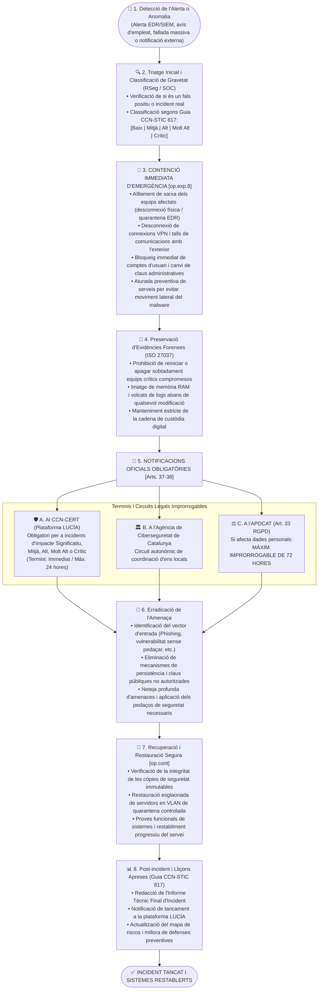

# Procediment Operatiu de Seguretat (POS): Gestió i Notificació d'Incidents de Seguretat de la Informació

> **Marc Normatiu de Referència:** Reial Decret 311/2022 (ENS) — Arts. 36 a 38 i Mesura `[op.exp.8]` (Gestió d'Incidents de Seguretat), Guia CCN-STIC 817 (Gestió d'Incidents de Seguretat Nacional), Plataforma LUCÍA (CCN-CERT), Art. 33 i 34 del Reglament General de Protecció de Dades (RGPD - Notificació de bretxes en 72 hores a l'APDCAT) i Llei de l'Agència de Ciberseguretat de Catalunya.  
> **Àmbit d'Aplicació:** Qualsevol esdeveniment que comprometi o amenaci la Disponibilitat, Autenticitat, Integritat, Confidencialitat o Traçabilitat (DAICT) dels actius i serveis municipals.

---

## 1. Objectiu i Abast

Aquest procediment defineix l'estratègia operativa i el protocol immediat de resposta que s'ha d'activar a l'Ajuntament davant qualsevol ciberincident (infeccions per *ransomware*, accessos no autoritzats, fuites de dades personals, atacs de denegació de servei o fallades crítiques d'infraestructura).

Estableix les obligacions legals improrrogables de comunicació a les autoritats nacionals (**CCN-CERT** a través de la plataforma **LUCÍA**) i a l'autoritat de protecció de dades (**APDCAT** en un termini màxim de **72 hores**), així com el circuit tècnic de contenció, preservació d'evidències, erradicació i restauració segura.

---

## 2. Rols Intervinents segons l'ENS

| Rol ENS | Responsable / Òrgan | Responsabilitats Específiques durant l'Incident |
| :--- | :--- | :--- |
| **Responsable de la Seguretat (RSeg / CISO)** | Cap de Seguretat de la Informació | **Director de la Crisi:** Lidera la resposta tècnica, coordina la investigació, determina el nivell d'impacte segons la Guia CCN-STIC 817 i gestiona la notificació oficial al CCN-CERT via LUCÍA. |
| **Responsable del Sistema (RSis)** | Cap d'Informàtica / Administrador TIC | Executa les ordres de contenció immediata (aïllament d'equips, tall de xarxa, revocació de claus), preserva evidències i lidera la restauració des de còpies segures. |
| **Delegat de Protecció de Dades (DPD)** | DPD Municipal | Avalua si l'incident constitueix una violació de dades personals (*Data Breach*) i gestiona la **notificació formal preceptiva a l'APDCAT en menys de 72 hores**. |
| **Responsable de la Informació i del Servei (RI / RS)** | Caps d'Àrea afectats | Informen sobre l'impacte en els procediments administratius i avaluen els perjudicis als ciutadans. |
| **Gabinet de Crisi / Alcaldia** | Alcalde/ssa, Secretaria i CISO | Convocat en incidents de gravetat **Molt Alta o Crítica** per autoritzar decisions dràstiques (aturada total de serveis, comunicació pública institucional). |
| **Centre d'Operacions de Ciberseguretat (SOC)** | SOC Local / AOC / CCN-CERT | Proporciona suport remot especialitzat, anàlisi de telemetria, telemetria d'amenaces i suport d'anàlisi forense. |

---

## 3. Diagrama de Flux del Procediment

---

## 4. Fases Detallades d'Execució

### Fase 1: Detecció i Notificació Inicial
L'incident es pot originar per:
1. **Detecció automàtica:** Alertes de la consola centralitzada de l'EDR, del SIEM corporatiu o del Centre d'Operacions de Ciberseguretat (SOC).
2. **Notificació interna:** Un empleat públic truca al servei de suport (Helpdesk) advertint que la pantalla s'ha bloquejat amb una nota de rescat (*ransomware*), que rep correus d'extorsió o que observa comportaments anòmals.
3. **Notificació externa:** Alerta provinent del CCN-CERT, de l'Agència de Ciberseguretat de Catalunya o de ciutadans.

### Fase 2: Triatge i Classificació de l'Impacte (Guia CCN-STIC 817)
El Responsable de Seguretat (RSeg) analitza l'incident i determina la seva perillositat segons els criteris del CCN:
- **Crític / Molt Alt:** Atac massiu de xifratge (*ransomware*) que atura els serveis essencials municipals o compromís total dels controladors de domini.
- **Alt:** Afecció a diversos servidors de producció o compromís de dades sensibles ciutadanes (Padró, Serveis Socials, Gestió Tributària).
- **Mitjà:** Infecció continguda en un únic equip de lloc de treball o intent d'accés no autoritzat interceptat.
- **Baix:** Alertes lleus sense impacte en dades ni continuïtat (bloquejos de correus de *phishing*).

### Fase 3: Contenció Immediata (`[op.exp.8]`)
L'objectiu prioritari és **frenar la propagació** de l'amenaça:
1. **Aïllament lògic o físic:** Desconnexió immediata del cable de xarxa o aïllament des de la consola EDR de qualsevol equip infectat.
2. **Tall de comunicacions:** Si l'atac és massiu, es desactiven les connexions VPN corporatives i es tallen temporalment les sortides a Internet des dels servidors.
3. **Revocació de credencials:** Bloqueig preventiu de tots els comptes corporatius compromesos i canvi d'emergència de les claus del domini (*KRBTGT* en entorns Active Directory) i dels usuaris administradors.

### Fase 4: Preservació d'Evidències Forenses (ISO 27037)
> ⚠️ **Norma bàsica d'actuació:** **NO apagar mai directament d'interruptor ni reiniciar** un servidor infectat abans de capturar la memòria volàtil (RAM), ja que s'eliminarien les claus criptogràfiques temporals i els rastres d'execució del malware en memòria.
- L'equip tècnic realitza un bolcat de la memòria RAM utilitzant eines forenses homologades.
- S'extreuen i es guarden còpies certificades dels registres d'auditoria (logs) dels firewalls, servidors i servidors d'identitat.

### Fase 5: Notificació Oficial Obligatòria (Arts. 37 i 38 RD 311/2022)
1. **CCN-CERT (Plataforma LUCÍA):**
   - L'Ajuntament comunica l'incident mitjançant el portal oficial **LUCÍA** del Centre Criptològic Nacional.
   - S'informa del tipus d'atac, sistemes afectats i mesures de contingència adoptades.
2. **APDCAT (Art. 33 RGPD - Violació de la seguretat de dades personals):**
   - Si l'incident implica pèrdua de confidencialitat, alteració o destrucció de dades personals, el **DPD municipal** té l'obligació de notificar l'incident a l'**Autoritat Catalana de Protecció de Dades (APDCAT)** en el termini **MÀXIM IMPRORROGABLE DE 72 HORES**.
3. **Comunicació a la Ciutadania (Art. 34 RGPD):**
   - Si l'incident suposa un alt risc per als drets i llibertats de les persones físiques afectades (p. ex., sostracció de dades bancàries o de salut), s'ha de comunicar directament als afectats o mitjançant avís públic a la Seu Electrònica i portals oficials.

### Fase 6: Erradicació i Restauració Segura
1. **Desinfecció:** Identificació i clausura de la porta d'entrada emprada pels atacants (pedaç de seguretat, tancament de port exposat, canvi de credencial filtrada).
2. **Restauració neta:**
   - No es reinstal·la sobre sistemes corromputs: es formategen els discos i es restableix la configuració des d'imatges netes i verificades.
   - Les dades es recuperen exclusivament des de les **còpies de seguretat immutables (*Air-Gapped*)** generades abans de la data estimada d'infecció inicial.

### Fase 7: Activitats Postincident i Lliçons Apreses
1. Redacció de l'**Informe Tècnic Final de l'Incident** amb la cronologia completa, anàlisi d'impacte, costos i causes arrel.
2. Tancament oficial de l'incident a la plataforma LUCÍA del CCN-CERT.
3. Sessió de lliçons apreses entre el Gabinet de Crisi, RSeg, RSis i DPD per identificar millores en les mesures preventives de l'ENS.

---

## 5. Resum dels Terminis Crítics Legals davant Incidents

| Destinatari de la Notificació | Mitjà Oficial | Termini Legal Màxim | Obligatorietat |
| :--- | :--- | :--- | :--- |
| **CCN-CERT** | Plataforma **LUCÍA** | Immediat / **Màxim 24 hores** segons gravetat | **Obligatori per l'ENS** (Art. 37 RD 311/2022) |
| **Agència de Ciberseguretat de Cat.** | Portal de notificació / CSIRT | Immediat / **Màxim 24 hores** | **Obligatori per entitats locals de Catalunya** |
| **APDCAT** | Seu electrònica APDCAT | **MÀXIM 72 HORES** des del coneixement | **Obligatori per Art. 33 RGPD** (si afecta dades personals) |
| **Ciutadans Afectats** | Comunicació directa / Seu | Sense dilacions indegudes | **Obligatori per Art. 34 RGPD** (si hi ha risc alt per a drets) |
