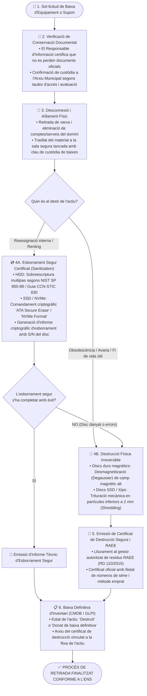

# Procediment Operatiu de Seguretat (POS): Baixa i Destrucció Segura d'Equipament i Suports d'Informació

> **Marc Normatiu de Referència:** Reial Decret 311/2022 (ENS) — Mesures `[mp.eq.4]` (Retirada i reutilització de dispositius), `[mp.si.5]` (Tractament i destrucció segura de suports d'informació), Guia CCN-STIC 830 (Mesures de seguretat per a l'eliminació d'informació en suports d'emmagatzematge), NIST SP 800-88 Rev. 1 (Guidelines for Media Sanitization) i Reial Decret 110/2015 sobre residus d'aparells elèctrics i electrònics (RAEE).  
> **Àmbit d'Aplicació:** Retirada, reassignació o destrucció de servidors, discs durs (HDD/SSD), ordenadors, portàtils, unitats de cinta de backup, memòries USB i qualsevol suport físic que hagi contingut informació municipal.

---

## 1. Objectiu i Abast

Aquest procediment estableix el mètode obligatori per garantir que cap dispositiu o suport d'emmagatzematge municipal sigui retirat, reassignat a un altre departament, retornat a un arrendador (*renting / leasing*) o enviat a reciclatge **sense la desmilitarització prèvia (*sanitization*) o destrucció física irreversible** de les dades contingudes.

L'incompliment d'aquest procediment comporta un risc gravíssim de violació massiva de la confidencialitat de la informació pública i de dades personals de la ciutadania (infracció molt greu del RGPD i de l'ENS).

---

## 2. Rols Intervinents segons l'ENS

| Rol ENS | Responsable / Departament | Funcions Específiques |
| :--- | :--- | :--- |
| **Responsable de la Informació (RI)** | Cap d'Àrea titular de les dades | Autoritza la baixa definitiva de la informació i certifica que s'han preservat les còpies necessàries segons els calendaris de conservació del patrimoni documental. |
| **Responsable de la Seguretat (RSeg / CISO)** | Cap de Seguretat de la Informació | Fixa el mètode tècnic d'esborrament o destrucció aplicable segons la classificació de la informació (Bàsica, Mitjana o Alta) i verifica el certificat de destrucció. |
| **Responsable del Sistema (RSis)** | Cap d'Informàtica / Administrador TIC | Custòdia els equips retirats en una zona tancada sota clau, executa o supervisa l'esborrament segur o entrega els suports al gestor autoritzat. |
| **Gestor Homologat de Residus (RAEE)** | Empresa externa de destrucció certificada | Realitza la destrucció mecànica in situ o a planta autoritzada i emet el certificat oficial de destrucció i valorització ambiental. |

---

## 3. Diagrama de Flux del Procediment

---

## 4. Fases Detallades d'Execució

### Fase 1: Autorització i Verificació de Conservació de la Informació
Abans d'eliminar qualsevol suport:
1. El **Responsable de la Informació (RI)** i l'arxiver/a municipal verifiquen que la informació continguda en el servidor o disc no és l'única còpia d'expedients administratius subjectes a obligació de custòdia permanent segons la normativa de patrimoni documental de Catalunya.
2. Si conté dades necessàries, es migren prèviament a l'arxiu digital corporatiu o a una altra infraestructura homologada.

### Fase 2: Trasllat a la Zona de Custòdia Segura (`[mp.if.2]`)
1. Els equips retirats es desconnecten de la xarxa corporativa i es donen de baixa temporal a l'Active Directory.
2. Es traslladen a un magatzem físic d'accés restringit i tancat amb clau, reservat per al material pendent de baixa, per evitar sostraccions o accessos no autoritzats d'empleats o personal de neteja.

### Fase 3: Tècniques de Desmilitarització i Destrucció (Guia CCN-STIC 830)
Segons el destí de l'actiu, s'aplica una de les dues vies tècniques:

#### Via A: Esborrament Segur Lògic (*Sanitization* - Per a reutilització o devolució de *renting*)
- **Discs magnètics tradicionals (HDD):**
  - Aplicació de sobreescriptura de blocs lògics mitjançant eines homologades (p. ex., *Blancco, DBAN o eines certificades CPSTIC*).
  - Execució de patró de sobreescriptura d'acord amb la norma **NIST SP 800-88 Rev. 1 Clear/Purge**.
- **Discs d'estat sòlid (SSD, NVMe, mòduls flash):**
  - Com que els SSD utilitzen algorismes interns d'anivellament de desgast (*wear leveling*), la sobreescriptura tradicional de sectors és ineficaç.
  - S'ha d'executar preceptivament l'ordre interna del controlador de maquinari **ATA Secure Erase**, **NVMe Cryptographic Erase** o destrucció de la clau mestra de xifratge de maquinari (SED - *Self-Encrypting Drive*).
- **Resultat:** L'eina genera un informe digital signat amb el número de sèrie del disc verificant que no queda cap dada recuperable.

#### Via B: Destrucció Física Irreversible (*Destruction* - Per a material obsolet o avariat)
- **Desmagnetització (*Degaussing*):** Exposició dels discs HDD a un potent camp magnètic (superior a 1 Tesla) que destrueix permanentment les pistes magnètiques i els servomecanismes del plat.
- **Trituració mecànica (*Shredding*):** Els discs (especialment els SSD) s'introdueixen en una trituradora mecànica industrial que converteix els components en partícules metàl·liques i fragments inferiors a **2 mm**, impossibilitant qualsevol lectura per microscòpia electrònica.

### Fase 4: Certificat de Destrucció i Gestió Ambiental RAEE (RD 110/2015)
1. Si la destrucció física la realitza una empresa externa, s'exigeix que sigui un gestor autoritzat de residus d'aparells elèctrics i electrònics (RAEE).
2. L'empresa lliura a l'Ajuntament el **Certificat Oficial de Destrucció Segura**, detallant:
   - Data, hora i lloc de la destrucció.
   - Llistat nominal de tots els números de sèrie dels equips i suports destruïts.
   - Mètode mecànic emprat i mida màxima de partícula residual.
   - Destinació ecològica dels residus reciclables.

### Fase 5: Baixa Definitiva de l'Inventari (CMDB)
1. El Responsable del Sistema actualitza la fitxa de l'equip a la CMDB/GLPI, canviant el seu estat a *«Destruït»* o *«Baixa Definitiva»*.
2. S'adjunta el certificat d'esborrament o destrucció signat a la fitxa de l'actiu per a la seva traçabilitat davant futures auditories de l'ENS.

---

## 5. Llista de Verificació (Checklist) de Baixa de Suports

- [ ] L'arxiver/a i el Responsable d'Informació han confirmat que no hi ha documents administratius únics pendents de conservació.
- [ ] L'equip s'ha traslladat i custodiat a la sala tancada sota clau de baixes.
- [ ] En equips per a reutilització, s'ha aplicat l'esborrament segur segons la Guia CCN-STIC 830 / NIST SP 800-88.
- [ ] En equips obsolets o avariats, s'ha procedit a la destrucció física mecànica o desmagnetització.
- [ ] Es disposa del Certificat Oficial de Destrucció amb el detall de tots els números de sèrie afectats.
- [ ] S'ha actualitzat la fitxa de l'actiu a la CMDB/GLPI i s'ha adjuntat la documentació probatòria.
