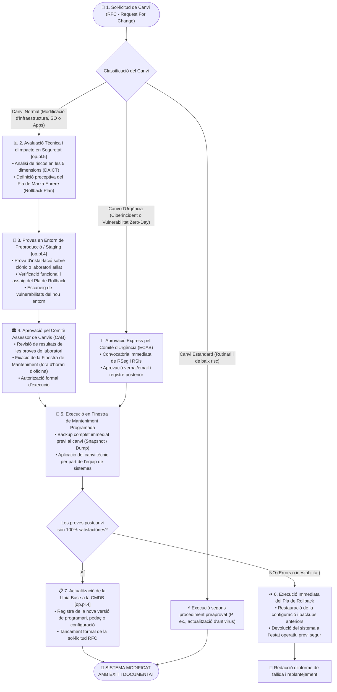

# Procediment Operatiu de Seguretat (POS): Gestió de Canvis i Actualitzacions en Producció

> **Marc Normatiu de Referència:** Reial Decret 311/2022 (ENS) — Mesures `[op.pl.4]` (Gestió de la configuració), `[op.pl.5]` (Manteniment i canvis), `[op.exp.4]` (Gestió de vulnerabilitats i pedaços de seguretat), Guia CCN-STIC 805 / 806 i bones pràctiques d'ITIL v4.  
> **Àmbit d'Aplicació:** Qualsevol modificació sobre la infraestructura de xarxa, servidors de producció, bases de dades municipals, sistemes operatius, aplicacions de gestió o configuracions de seguretat de l'Ajuntament.

---

## 1. Objectiu i Abast

Aquest procediment estableix el marc de control obligatori per planificar, avaluar, aprovar, provar i executar qualsevol canvi tècnic o actualització als sistemes d'informació en producció.

L'objectiu de l'**Esquema Nacional de Seguretat (RD 311/2022)** és assegurar que cap modificació pugui introduir noves vulnerabilitats, degradar el nivell de seguretat assolit, comprometre la continuïtat dels serveis públics o alterar la integritat de les dades sense una avaluació prèvia del risc i un pla de recuperació (*rollback*) degudament assajat.

---

## 2. Rols Intervinents segons l'ENS

| Rol ENS | Responsable / Òrgan | Responsabilitats Específiques en la Gestió de Canvis |
| :--- | :--- | :--- |
| **Sol·licitant del Canvi** | Tècnic de sistemes, proveïdor o usuari | Redacta la Sol·licitud de Canvi (**RFC - Request For Change**) justificant la necessitat tècnica o funcional. |
| **Responsable de la Seguretat (RSeg / CISO)** | Cap de Seguretat de la Informació | Avalua l'impacte del canvi sobre les cinc dimensions de seguretat (DAICT), verifica que no infringeix la PSI ni el marc ENS i té dret de veto. |
| **Comitè Assessor de Canvis (CAB)** | RSeg, RSis, Caps de Servei i Secretaria | Avalua la concurrència d'impactes en els serveis municipals, aprova el calendari i autoritza el pas a producció. |
| **Responsable del Sistema (RSis)** | Cap d'Informàtica / Administrador TIC | Supervisa les proves en preproducció, coordina l'execució del canvi en la finestra de manteniment i manté actualitzada la CMDB. |
| **Comitè de Canvis d'Urgència (ECAB)** | RSeg i RSis (òrgan reduït àgil) | Intervé exclusivament davant incidències crítiques o pedaços de seguretat de vulnerabilitats *Zero-Day* que requereixen intervenció immediata. |

---

## 3. Diagrama de Flux del Procediment

---

## 4. Fases Detallades d'Execució

### Fase 1: Sol·licitud i Registre del Canvi (RFC)
1. Tota modificació s'ha de tramitar formalment a l'eina ITSM municipal mitjançant un formulari RFC que inclogui:
   - Descripció detallada del canvi (sistemes, serveis i dades implicades).
   - Justificació tècnica o normativa (p. ex., pedaç crític de seguretat, millora de rendiment, canvi normatiu).
   - Data i finestra temporal d'intervenció proposada.
   - Persona o proveïdor encarregat de l'execució.

### Fase 2: Avaluació de Seguretat i Classificació del Canvi
El Responsable de Seguretat (RSeg) analitza la petició i classifica el canvi en una de les tres modalitats:
1. **Canvi Estàndard:** Canvi repetitiu, documentat, de baix risc i prèviament autoritzat (p. ex., actualització periòdica de firmes d'EDR, reinici programat de servidors secundaris). S'executa directament sense passar pel ple del CAB.
2. **Canvi Normal:** Modificació estructural que afecta servidors, comunicacions, regles de firewall, canvis de versió de bases de dades o desplegament de nous mòduls. Requereix passar pel circuit complet (proves, CAB i finestra).
3. **Canvi d'Urgència:** Necessari per restablir un servei crític caigut o per tapar una vulnerabilitat de seguretat explotada activament (*Zero-Day*). S'aprova de forma àgil per l'**ECAB** (RSeg + RSis) i es documenta a posteriori en un termini màxim de 48 hores.

### Fase 3: Proves Obligatòries en Entorn de Preproducció (`[op.pl.4]`)
> ⚠️ **Norma imperativa de l'ENS:** **Es prohibeix terminantment provar canvis directament sobre els entorns de producció municipal.**
1. El canvi s'executa primer en un entorn de proves (*Staging / Preproducció*) que simuli la configuració de producció.
2. Es verifiquen les compatibilitats i el rendiment.
3. **Assaig del Pla de Marxa Enrere (*Rollback*):** S'ha de verificar documentalment com es tornarà a l'estat anterior en cas d'avaria (mitjançant *snapshot* de virtualització, restauració de còpia o desinstal·lació del pedaç).

### Fase 4: Aprovació pel CAB i Finestra de Manteniment
1. El Comitè de Canvis (CAB) analitza les sol·licituds setmanalment.
2. Es fixa una **finestra de manteniment programada** (habitualment en horari nocturn o en cap de setmana) per evitar interrompre l'atenció ciutadana o la feina administrativa dels empleats públics.
3. S'avisa prèviament als serveis municipals afectats si es preveu una indisponibilitat temporal del servei.

### Fase 5: Execució, Validació i Actualització de la CMDB (`[op.pl.4]`)
1. **Snapshot de seguretat:** Abans d'iniciar la intervenció, es genera un punt de restauració o còpia de seguretat immediata de l'estat del sistema.
2. **Execució i Proves Post-Implementació:** Es realitzen les comprovacions funcionals pactades (*smoke tests*).
   - Si tot funciona: Es dóna per bo el canvi.
   - Si es detecten errors greus: S'activa automàticament el **Pla de Rollback** abans que finalitzi la finestra de manteniment.
3. **Actualització de la CMDB:** S'actualitza la fitxa de l'actiu a l'inventari amb la nova versió, data d'execució i tècnic responsable.

---

## 5. Llista de Verificació (Checklist) de Gestió de Canvis

- [ ] S'ha registrat formalment la petició RFC amb tots els camps completats.
- [ ] El Responsable de Seguretat (RSeg) ha avaluat l'impacte sobre les dimensions DAICT.
- [ ] S'ha redactat i assajat el Pla de Marxa Enrere (Rollback Plan).
- [ ] S'han realitzat proves satisfactòries en entorn aïllat de preproducció.
- [ ] El canvi ha estat aprovat formalment pel Comitè CAB (o ECAB en emergències).
- [ ] S'ha comunicat la finestra de manteniment als usuaris afectats.
- [ ] S'ha efectuat una còpia de seguretat prèvia immediata abans d'iniciar el canvi.
- [ ] S'han superat les proves funcionals de validació postcanvi.
- [ ] S'ha actualitzat la configuració de la línia base a la CMDB/inventari.
