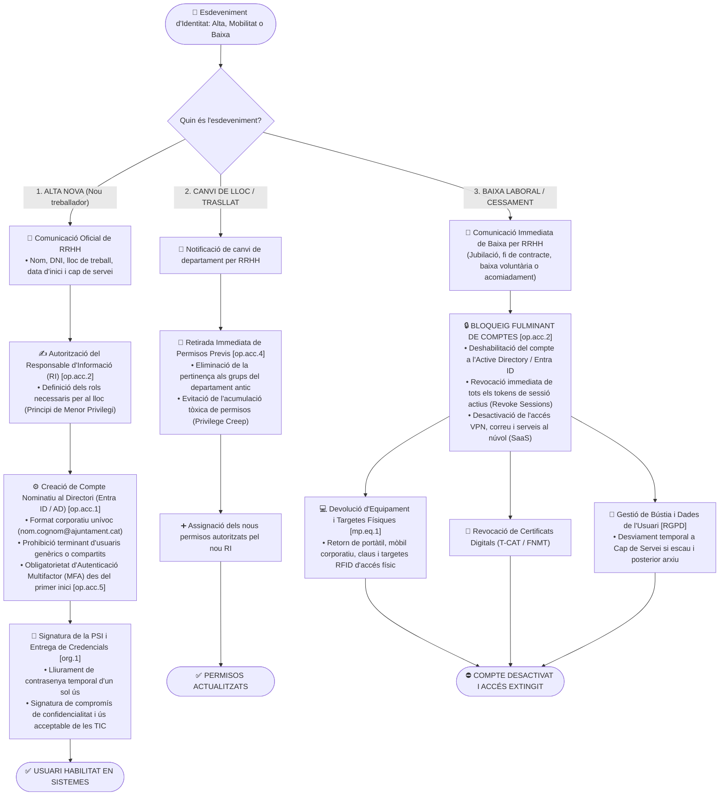

# Procediment Operatiu de Seguretat (POS): Cicle de Vida d'Identitats i Gestió d'Accessos d'Usuaris

> **Marc Normatiu de Referència:** Reial Decret 311/2022 (ENS) — Mesures `[op.acc.1]` (Identificació), `[op.acc.2]` (Requisits d'accés), `[op.acc.3]` (Segregació de funcions), `[op.acc.4]` (Drets d'accés i menor privilegi), `[op.acc.5]` (Autenticació i MFA) i Art. 32 del RGPD.  
> **Àmbit d'Aplicació:** Tots els empleats públics (funcionaris de carrera, interins, personal laboral), càrrecs electes, personal eventual i treballadors externs de proveïdors que requereixin accés als sistemes municipals.

---

## 1. Objectiu i Abast

Aquest procediment regula de manera estricta el cicle de vida complet dels comptes d'usuari corporatiu i els seus permisos: **Altes (incorporacions), Canvis (mobilitat interna) i Baixes (cessaments o jubilacions)**.

L'objectiu de l'**Esquema Nacional de Seguretat (RD 311/2022)** és garantir que:
1. Tot accés als sistemes sigui **nominatiu i unívocament traçable** (prohibició expressa de comptes genèrics o compartits).
2. S'apliqui amb rigor el **principi de menor privilegi (*Least Privilege*)** i la **necessitat de conèixer (*Need-to-Know*)**.
3. Es bloquegi l'accés de manera fulminant en el mateix instant en què s'extingeix la relació laboral amb l'Ajuntament.

---

## 2. Rols Intervinents segons l'ENS

| Rol ENS | Responsable / Departament | Funcions Específiques |
| :--- | :--- | :--- |
| **Recursos Humans (RRHH)** | Departament de Personal | Notifica formalment les altes, mobilitats internes i baixes contractuals amb les dates exactes d'efectes. |
| **Responsable de la Informació (RI)** | Cap d'Àrea de les dades | Autoritza formalment l'accés als fitxers i bases de dades del seu departament segons les funcions del lloc. |
| **Responsable de la Seguretat (RSeg / CISO)** | Cap de Seguretat de la Informació | Defineix la política de contrasenyes, els requisits de MFA, supervisa la segregació de funcions i coordina les revisions periòdiques d'accessos. |
| **Responsable del Sistema (RSis)** | Equip d'Administració de Sistemes | Executa l'aprovisionament al directori (Active Directory / Entra ID), assigna grups segons perfils autoritzats i executa el bloqueig immediat en baixes. |

---

## 3. Diagrama de Flux del Procediment

---

## 4. Fases Detallades d'Execució

### Fase 1: Circuit d'Alta d'Usuari (`[op.acc.1]`, `[op.acc.2]`)
1. **Sol·licitud formal:** El departament de Recursos Humans comunica la contractació a través de l'eina de tiquets amb una antelació mínima de 5 dies hàbils.
2. **Definició de permisos basada en rols (RBAC):**
   - El compte s'assigna exclusivament als grups de seguretat vinculats al seu lloc de treball específic.
   - **Principi de menor privilegi:** L'usuari només tindrà accés a les carpetes i mòduls d'aplicacions estrictament indispensables per a les seves tasques quotidianes.
3. **Mecanisme d'autenticació (`[op.acc.5]`):**
   - Es genera una contrasenya temporal d'alta complexitat que el treballador ha de canviar obligatòriament en el primer inici de sessió.
   - **MFA Preceptiu:** Es força l'enrolament en doble factor d'autenticació (mitjançant aplicació mòbil corporativa *Microsoft Authenticator* o clau FIDO2 física). No es permet l'accés sense MFA.
4. **Compromís de confidencialitat:** L'empleat signa formalment el document d'acceptació de la Política de Seguretat de la Informació (PSI) i la clàusula de confidencialitat sobre les dades personals a les quals tindrà accés.

### Fase 2: Circuit de Mobilitat Interna (Canvi de Departament)
> ⚠️ **Risc clau d'auditoria ENS:** L'acumulació progressiva de permisos (*Privilege Creep*). Sovint, quan un funcionari canvia d'Àrea (p. ex., de Padró a Urbanisme), se li afegeixen els permisos nous però mai se li retiren els antics, vulnerant el principi de menor privilegi.
1. RRHH notifica el canvi de destí del treballador.
2. Els administradors de sistemes **eliminen en primer lloc tots els grups de seguretat de l'àrea d'origen**.
3. S'incorporen exclusivament els permisos aprovats pel Responsable de la Informació de la nova àrea.

### Fase 3: Circuit de Baixa i Bloqueig Immediat (`[op.acc.2]`)
En cas de finalització del contracte, renúncia, trasllat d'administració, jubilació o suspensió:
1. **Termini d'execució:** El compte s'ha de deshabilitar el **mateix dia i a l'hora exacta de finalització** de la prestació de serveis.
2. **Accions tècniques immediates:**
   - Deshabilitació del compte a l'Active Directory i a Microsoft Entra ID.
   - **Revocació de sessions actives:** Execució de l'ordre de revocació de tokens per expulsar l'usuari de qualsevol dispositiu mòbil, sessió web o aplicació oberta.
   - Desactivació de les llicències d'aplicacions al núvol (Microsoft 365, portals SaaS).
3. **Certificats Digitals:** Si l'empleat disposava de certificat corporatiu en targeta o programari (T-CAT de l'AOC / FNMT d'empleat públic), se sol·licita la seva **revocació immediata** a l'entitat emissora.
4. **Recollida de béns:** Lliurament de l'ordinador portàtil corporatiu, telèfon intel·ligent, targetes d'accés RFID a l'edifici municipal i claus físiques dels despatxos.

### Fase 4: Revisions Periòdiques d'Accessos (`[op.acc.4]`)
- **Freqüència:** Com a mínim **un cop l'any** (o semestralment per a sistemes de categoria Alta), el Responsable de Seguretat (RSeg) extreu el cens complet d'usuaris actius i els seus grups.
- **Revisió per part dels Caps de Servei:** Els Responsables d'Informació revisen el llistat dels seus departaments i firmen l'acta de conformitat o sol·liciten la depuració d'usuaris orfes o permisos obsolets.

---

## 5. Llista de Verificació (Checklist) de Gestió d'Identitats

- [ ] L'alta s'ha realitzat mitjançant comunicació formal de RRHH.
- [ ] El compte d'usuari és personal i unívoc (mai genèric).
- [ ] Els permisos s'ajusten al perfil mínim requerit aprovat pel Responsable d'Informació.
- [ ] L'usuari ha enrolat el doble factor d'autenticació (MFA) obligatori.
- [ ] L'empleat ha signat el document de confidencialitat i acceptació de la PSI.
- [ ] En canvis de lloc, s'han suprimit prèviament tots els accessos de l'àrea antiga.
- [ ] En baixes, el compte s'ha bloquejat el mateix dia i s'han revocat totes les sessions actives.
- [ ] S'ha sol·licitat la revocació del certificat digital d'empleat públic (T-CAT).
- [ ] S'ha recollit tot l'equipament físic i targetes d'accés.
- [ ] Es realitza la recertificació periòdica d'usuaris amb els Caps de Servei.
