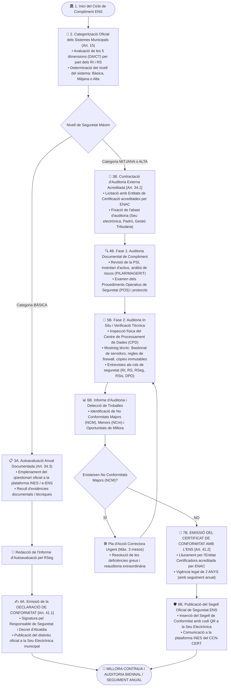

# Procediment Operatiu de Seguretat (POS): Auditoria i Certificació de Conformitat amb l'ENS

> **Marc Normatiu de Referència:** Reial Decret 311/2022 (ENS) — Arts. 34 (Auditoria de seguretat), 35 (Informes d'auditoria), 41 (Conformitat amb l'ENS), Guia CCN-STIC 803 (Autoavaluació), Guia CCN-STIC 809 (Declaració i Certificació de Conformitat) i Guia CCN-STIC 824 (Metodologia d'Auditoria de l'ENS).  
> **Àmbit d'Aplicació:** Tots els sistemes d'informació, serveis electrònics ciutadans i procediments administratius de l'Ajuntament.

---

## 1. Objectiu i Abast

Aquest procediment estableix el cicle formal per auditar, avaluar i acreditar oficialment el compliment de l'**Esquema Nacional de Seguretat (RD 311/2022)** davant la ciutadania, el Centre Criptològic Nacional (**CCN-CERT**) i els organismes reguladors.

L'ENS estableix una diferenciació metodològica clara segons la categoria de seguretat del sistema:
- **Categoria BÀSICA:** Exigeix una **Declaració de Conformitat** derivada d'una autoavaluació interna o concertada formalment documentada (mínim anual).
- **Categories MITJANA i ALTA:** Exigeixen un **Certificat de Conformitat** expedit exclusivament per una **Entitat d'Auditoria i Certificació acreditada per ENAC**, amb periodicitat **biennal (cada 2 anys)** i una auditoria de seguiment intermèdia anual.

---

## 2. Rols Intervinents segons l'ENS

| Rol ENS | Responsable / Òrgan | Responsabilitats en el Procés d'Auditoria |
| :--- | :--- | :--- |
| **Alcaldia / Ple Municipal** | Òrgan Superior de Govern | Aprova la Política de Seguretat de la Informació (PSI) i signa formalment la Declaració de Conformitat o encarrega la contractació de l'auditoria externa. |
| **Responsable de la Seguretat (RSeg / CISO)** | Cap de Seguretat de la Informació | **Coordinador General de l'Auditoria:** Prepara les evidències, coordina l'autoavaluació prèvia a través de la plataforma INES/e-ENS, defensa el compliment davant els auditors externs i elabora el Pla d'Acció Correctora (PAC). |
| **Responsable de la Informació i del Servei (RI / RS)** | Caps d'Àrea i Serveis | Participen en les entrevistes d'auditoria, defensen la categorització dels seus procediments i faciliten les evidències funcionals. |
| **Responsable del Sistema (RSis)** | Cap d'Informàtica / Administrador TIC | Facilita les evidències tècniques (configuracions, bastionat, regles de firewall, logs del SIEM, còpies de seguretat) i acompanya els auditors a les instal·lacions del CPD. |
| **Entitat de Certificació Externa** | Empresa acreditada per ENAC | Executa l'auditoria formal independent (Fases 1 i 2), dictamina les no conformitats i emet el Certificat de Conformitat amb l'ENS. |

---

## 3. Diagrama de Flux del Procediment

---

## 4. Fases Detallades d'Execució

### Fase 1: Categorització dels Sistemes i Abast d'Auditoria
1. El **Comitè de Seguretat de la Informació** consolida l'abast dels sistemes d'informació municipals.
2. Si qualsevol servei gestiona informació amb impacte Mitjà o Alt en alguna de les 5 dimensions (com ara tràmits telemàtics amb certificat, gestió econòmica o padró d'habitants), tot el sistema que hi dona suport queda categoritzat en nivell **Mitjà o Alt**.

### Fase 2: Circuit per a Categoria Bàsica (Declaració de Conformitat)
1. **Autoavaluació:** El Responsable de Seguretat analitza les mesures de l'Annex II aplicables a nivell Bàsic mitjançant les eines **e-ENS** o la plataforma **INES** del CCN-CERT.
2. **Informe d'adequació:** Es redacta l'informe anual d'autoavaluació identificant l'estat de cada mesura.
3. **Declaració de Conformitat:** L'Alcalde/ssa o el Regidor delegat signa la *Declaració de Conformitat amb l'ENS*, que es publica a la Seu Electrònica i té una validesa d'un any.

### Fase 3: Circuit per a Categories Mitjana i Alta (Certificat de Conformitat ENAC)

#### Etapa A: Auditoria Documental (Fase 1)
L'equip auditor d'ENAC examina el corpus documental municipal:
- Política de Seguretat de la Informació (PSI) aprovada formalment.
- Nomenaments formals dels rols ENS (RI, RS, RSeg, RSis, DPD).
- Anàlisi de Riscos actualitzada (metodologia MAGERIT / eina PILAR).
- Procediments Operatius de Seguretat (POS) de còpies, canvis, incidents i accessos.
- Evidències de formació en ciberseguretat als empleats públics.

#### Etapa B: Auditoria Tècnica i Presencial (Fase 2)
1. **Inspecció d'instal·lacions:** Visita al CPD municipal per comprovar el control d'accés biomètric/targeta, sistema de climatització redundada, SAIs i extinció automàtica d'incendis mitjançant gas innocent (`[mp.if]`).
2. **Comprovacions tècniques aleatòries:**
   - Connexió a la consola de l'Active Directory / Entra ID per verificar que cap usuari comú és administrador local i que el MFA està activat (`[op.acc]`).
   - Verificació del xifratge BitLocker en una mostra de portàtils (`[mp.eq.3]`).
   - Comprovació de la immutabilitat de les còpies de seguretat i simulacre de restauració (`[op.cont]`).
   - Revisió de les regles de firewall i segmentació de xarxa per VLANs.

#### Etapa C: Dictamen, Pla d'Acció Correctora (PAC) i Emissió
1. L'equip auditor emet l'**Informe d'Auditoria**:
   - **No Conformitat Major (NCM):** Absència d'una mesura obligatòria o fallada que posa en risc greu el sistema (bloqueja l'emissió del certificat fins a la seva subsanació).
   - **No Conformitat Menor (NCm):** Desviació puntual que no compromet directament la seguretat global. L'Ajuntament presenta un Pla d'Acció Correctora (PAC) amb terminis de solució.
2. Un cop aprovat el PAC, la comissió de certificació de l'entitat acreditada emet el **Certificat de Conformitat amb l'ENS**.

### Fase 4: Vigència i Publicitat del Distintiu de Seguretat (Art. 41)
- **Vigència:** El certificat té una validesa màxima de **2 ANYS**.
- **Auditoria de seguiment:** Al cap d'un any d'haver obtingut el certificat s'ha de superar una auditoria intermèdia de seguiment.
- **Distintiu oficial:** L'Ajuntament adquireix el dret d'incorporar a la capçalera de la seva Seu Electrònica el **Segell Oficial de Conformitat amb l'ENS**, acompanyat de la categoria acreditada (Mitjana o Alta) i el número de certificat emès per ENAC.

---

## 5. Taula Comparativa: Declaració vs. Certificat de Conformitat

| Característica | Categoria BÀSICA | Categories MITJANA i ALTA |
| :--- | :--- | :--- |
| **Instrument Formal** | **Declaració de Conformitat** | **Certificat de Conformitat** |
| **Òrgan Avaluador** | Autoavaluació pel propi Ajuntament | **Entitat de Certificació acreditada per ENAC** |
| **Periodicitat Ordinària** | Autoavaluació anual | **Auditoria cada 2 ANYS** (+ seguiment anual) |
| **Eina Oficial de Suport** | Plataforma INES / e-ENS (CCN-CERT) | Metodologia Guia CCN-STIC 824 |
| **Exhibició de Segell** | Distintiu de Declaració a la Seu | **Segell Oficial de Certificació ENS** amb codi ENAC |
| **Auditoria Extraordinària** | En canvis estructurals rellevants | Preceptiva si hi ha canvis substancials o incidents greus |
