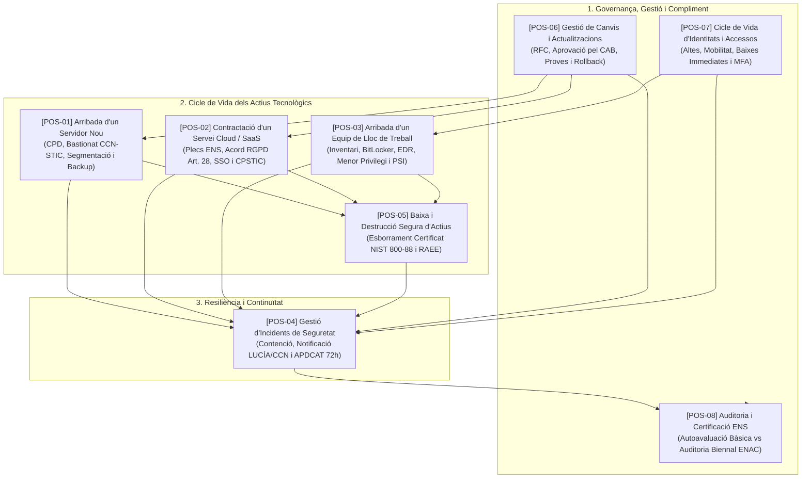
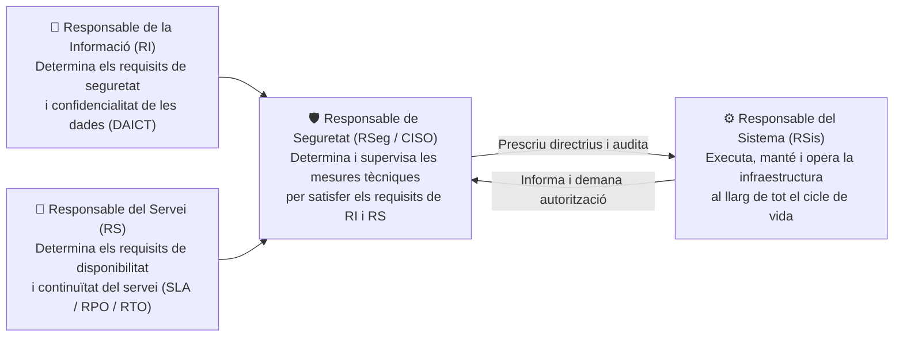

# Procediments Operatius de Seguretat (POS) de l'ENS (RD 311/2022)

Aquest directori conté el conjunt complet de **Procediments Operatius de Seguretat (POS)** de l'**Esquema Nacional de Seguretat (ENS - Reial Decret 311/2022)** adaptats específicament per a l'administració local (ajuntaments) i estructurats amb **diagrames de flux Mermaid**, taules de rols, fases detallades i llistes de verificació (*checklists*).

---

## 🗺️ Mapa General de Procediments de Seguretat de l'ENS

---

## 📚 Índex de Procediments Operatius

| Codi | Procediment Operatiu de Seguretat | Fitxer de Detall i Diagrama | Mesures ENS (RD 311/2022) |
| :---: | :--- | :--- | :--- |
| **POS-01** | **Arribada i Posada en Producció d'un Servidor Nou** | [01_arribada_servidor_nou.md](file:///home/oriol/Projectes/OPOS/recursos/procediments_ens/01_arribada_servidor_nou.md) | `[mp.eq.1]`, `[mp.eq.2]`, `[mp.if]`, `[op.pl.1]`, `[op.mon]`, `[op.cont]` |
| **POS-02** | **Contractació i Desplegament d'un Servei Cloud / SaaS** | [02_contractacio_servei_saas_nuvol.md](file:///home/oriol/Projectes/OPOS/recursos/procediments_ens/02_contractacio_servei_saas_nuvol.md) | Arts. 2.2, 9; `[op.ext.1]`, `[op.ext.2]`, `[op.acc]`, CCN-STIC 823 |
| **POS-03** | **Arribada i Aprovisionament d'un Equip de Lloc de Treball** | [03_arribada_equip_lloc_treball.md](file:///home/oriol/Projectes/OPOS/recursos/procediments_ens/03_arribada_equip_lloc_treball.md) | `[mp.eq.1]`, `[mp.eq.2]`, `[mp.eq.3]`, `[op.acc.4]`, `[mp.si.1]`, `[org.1]` |
| **POS-04** | **Gestió i Notificació d'Incidents de Seguretat** | [04_gestio_incidents_seguretat.md](file:///home/oriol/Projectes/OPOS/recursos/procediments_ens/04_gestio_incidents_seguretat.md) | Arts. 36-38; `[op.exp.8]`, CCN-STIC 817, Art. 33 RGPD (72h) |
| **POS-05** | **Baixa i Destrucció Segura d'Equipament i Suports** | [05_baixa_destruccio_segura_equips_suports.md](file:///home/oriol/Projectes/OPOS/recursos/procediments_ens/05_baixa_destruccio_segura_equips_suports.md) | `[mp.eq.4]`, `[mp.si.5]`, CCN-STIC 830, NIST SP 800-88, RD 110/2015 |
| **POS-06** | **Gestió de Canvis i Actualitzacions en Producció** | [06_gestio_canvis_actualitzacions.md](file:///home/oriol/Projectes/OPOS/recursos/procediments_ens/06_gestio_canvis_actualitzacions.md) | `[op.pl.4]`, `[op.pl.5]`, `[op.exp.4]`, ITIL v4 (RFC, CAB, Rollback) |
| **POS-07** | **Cicle de Vida d'Identitats i Gestió d'Accessos** | [07_cicle_vida_usuaris_accessos.md](file:///home/oriol/Projectes/OPOS/recursos/procediments_ens/07_cicle_vida_usuaris_accessos.md) | `[op.acc.1]`, `[op.acc.2]`, `[op.acc.3]`, `[op.acc.4]`, `[op.acc.5]` (MFA) |
| **POS-08** | **Auditoria i Certificació de Conformitat amb l'ENS** | [08_auditoria_certificacio_conformitat_ens.md](file:///home/oriol/Projectes/OPOS/recursos/procediments_ens/08_auditoria_certificacio_conformitat_ens.md) | Arts. 34, 35, 41; CCN-STIC 803, 809, 824, acreditació ENAC |

---

## 🏛️ Rols Fonamentals de Governança a l'ENS (Art. 11 i Mesura `[org.2]`)

Tots els procediments d'aquesta col·lecció es basen en el **Principi de Diferenciació de Responsabilitats**:

---

## 💡 Conceptes Clau i Terminis Improrrogables per a Oposicions

1. **Notificació de Bretxes de Dades Personals a l'APDCAT:** **Màxim 72 hores** des que se'n té coneixement (Art. 33 RGPD).
2. **Notificació d'Incidents de Seguretat al CCN-CERT:** Notificació obligatòria a través de la plataforma **LUCÍA** segons la perillositat de la Guia CCN-STIC 817.
3. **Periodicitat de l'Auditoria ENS:**
   - Categoria **Bàsica:** Autoavaluació documentada **anual** (Declaració de Conformitat).
   - Categories **Mitjana i Alta:** Auditoria formal per entitat acreditada per **ENAC** cada **2 ANYS** (amb seguiment intermedi a l'any).
4. **Principi de Menor Privilegi:** Cap usuari estàndard pot tenir permisos d'administrador local sobre el seu equip de treball.
5. **Autenticació Multifactor (MFA):** Requisit **obligatori per a tots els accessos remots (VPN, teletreball i SaaS)** i per a **comptes amb privilegis d'administració** (tant locals com remots). En inici de sessió local d'usuaris comuns, és obligatori en Categoria Alta (o dades d'alta sensibilitat mitjançant targeta criptogràfica, T-CAT o Windows Hello/FIDO2) i recomanat en Mitjana.
6. **Destrucció Segura:** Els suports que hagin contingut dades personals o informació municipal han de ser desmilitaritzats (esborrament segur) o destruïts físicament de forma certificada segons la Guia CCN-STIC 830 / NIST SP 800-88 abans del seu reciclatge o retirada.

---

## 💼 Casos Pràctics d'Oposicions Resolts
Podeu consultar supòsits pràctics complets d'aplicació d'aquests procediments a la carpeta:
👉 **[`recursos/casos_practics/`](file:///home/oriol/Projectes/OPOS/recursos/casos_practics/README.md)**
- **Cas 1:** Pla seqüencial per a aprovar i implantar l'ENS a l'organització.
- **Cas 2:** Contractació d'un SaaS i subministrament d'ordinadors i servidor (LCSP + ENS).
- **Cas 3:** Recepció, verificació, bastionat i conformitat de servidor, ordinadors i servei.

